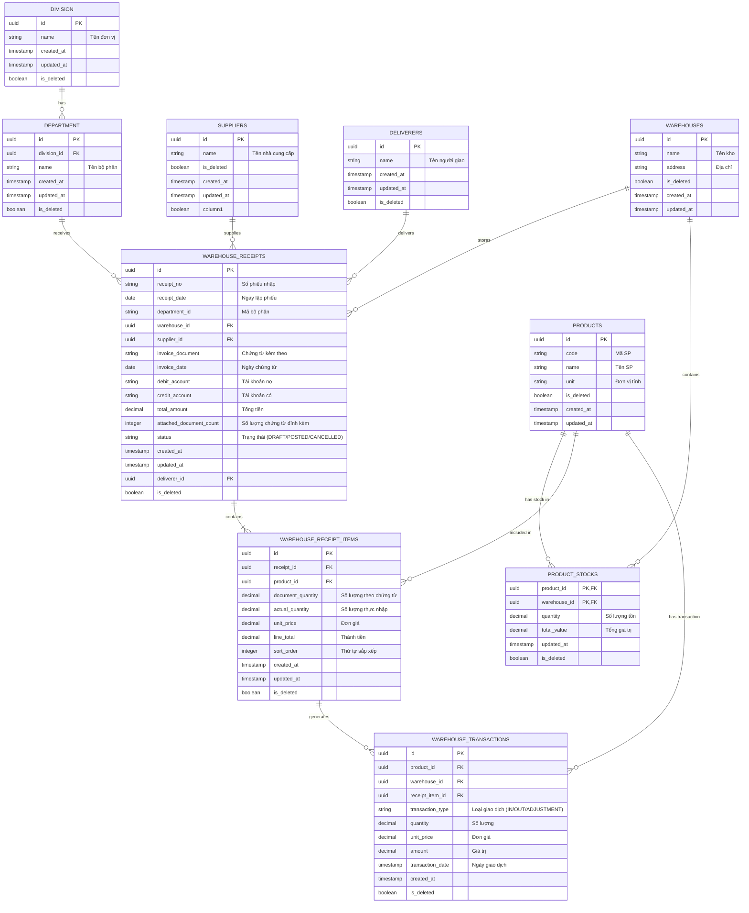

# Hệ thống quản lý kho (chức năng nhập liệu)

## Hướng dẫn cài đặt và Chạy

### 1. Yêu cầu hệ thống
- Node.js (phiên bản mới nhất)
- PostgreSQL đang hoạt động

### 2. Cấu hình cơ sở dữ liệu
Trong thư mục `server/`, tạo file `.env` (nếu chưa có) và cấu hình các thông số kết nối:
```env
DB_HOST=localhost
DB_PORT=5432
DB_USER=your_username
DB_PASSWORD=your_password
DB_NAME=inventory_management
PORT=3001
```

Chạy script khởi tạo database:
```bash
cd server
npm run db:init
```

### 3. Cài đặt và Chạy Backend
```bash
cd server
npm install
npm run dev
```
Server sẽ chạy tại: `http://localhost:3001`

### 4. Cài đặt và Chạy Frontend
```bash
cd client
npm install
npm run dev
```
Ứng dụng sẽ chạy tại: `http://localhost:3000`

### 5. Chạy bằng Docker

```bash
sudo docker compose up -d --build
```
Hệ thống sẽ tự động khởi tạo cơ sở dữ liệu (nạp sẵn file `init.sql`) và chạy:
- Frontend tại: `http://localhost:3000`
- Backend tại nội bộ (và map ra ngoài ở port `3001` nếu cần)

*Nếu bạn muốn thiết lập lại Database từ đầu (xóa sạch dữ liệu), hãy chạy:*
```bash
sudo docker compose down -v
sudo docker compose up -d
```

## Cấu trúc Cơ sở Dữ liệu

Hệ thống sử dụng PostgreSQL. Dưới đây là Sơ đồ thực thể quan hệ (ERD):



Các bảng chính sau:

- **Tổ chức**: `division` (Đơn vị), `department` (Bộ phận).
- **Danh mục**: `suppliers` (Nhà cung cấp), `warehouses` (Kho), `products` (Vật tư), `deliverers` (Người giao).
- **Nghiệp vụ Nhập kho**:
  - `warehouse_receipts`: Thông tin chung của phiếu nhập (Số phiếu, ngày nhập, đối tác...).
  - `warehouse_receipt_items`: Chi tiết từng mặt hàng trong phiếu nhập.
- **Tồn kho & Giao dịch**:
  - `product_stocks`: Lưu trữ số lượng tồn thực tế của vật tư theo từng kho.
  - `warehouse_transactions`: Nhật ký chi tiết mọi biến động xuất/nhập hàng hoá.

